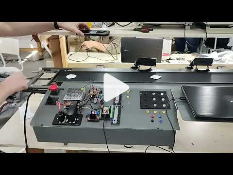
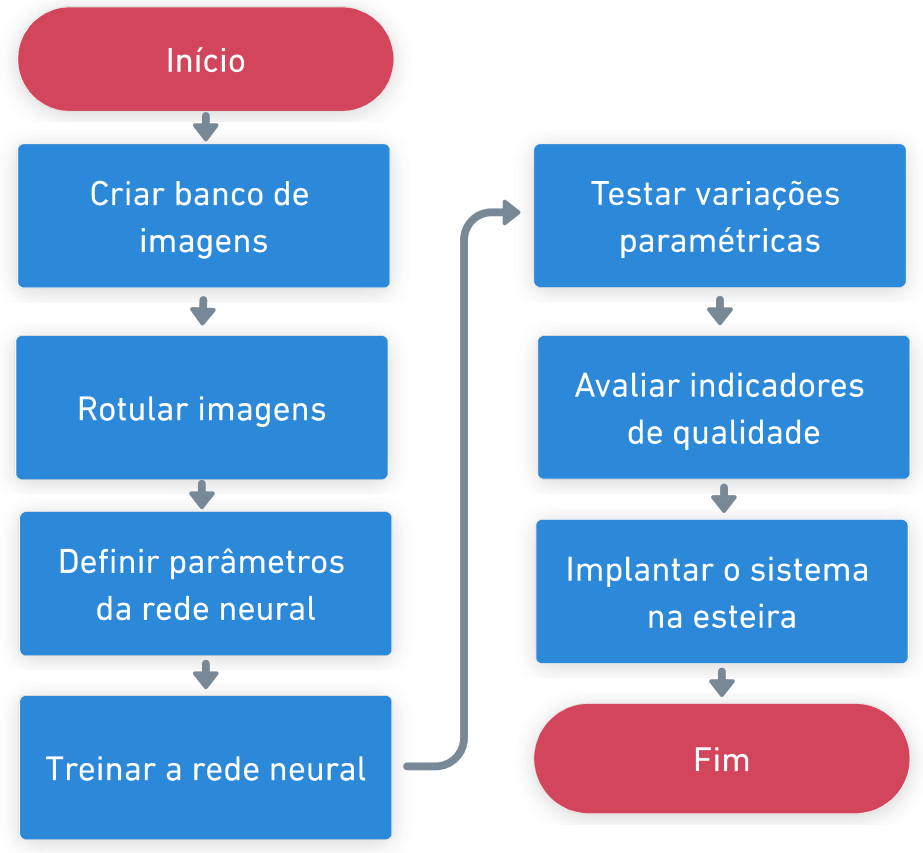
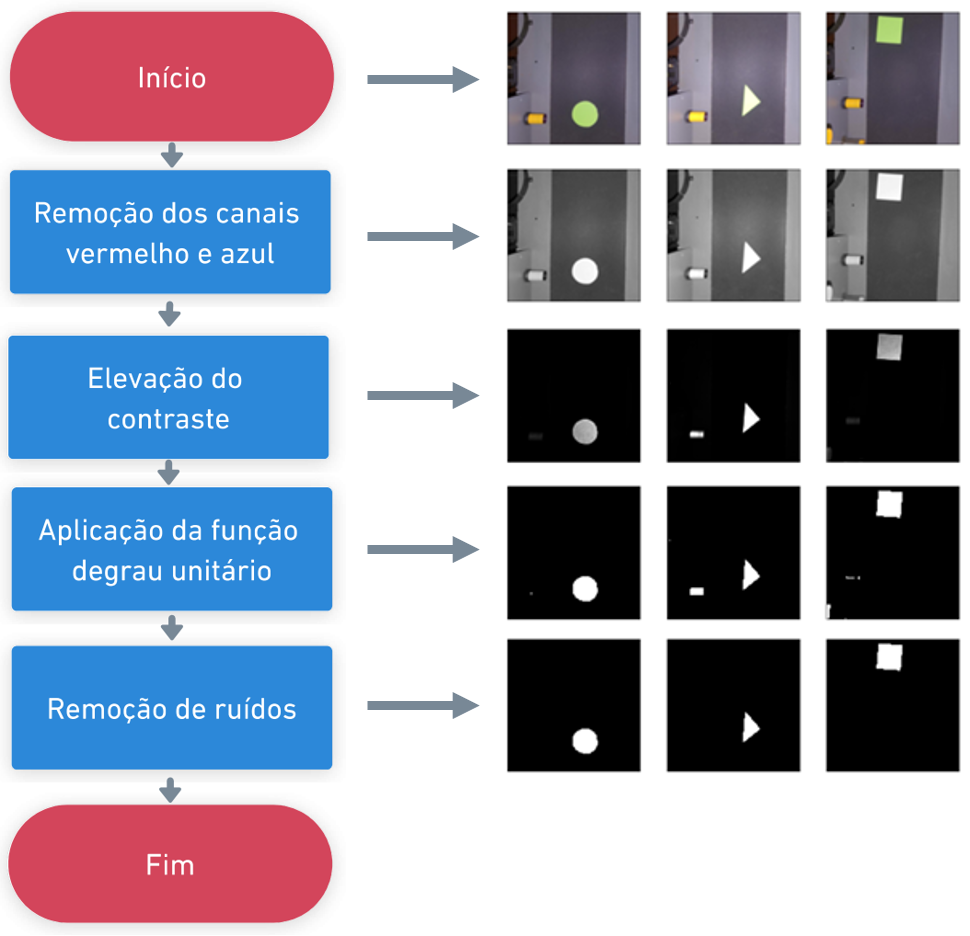
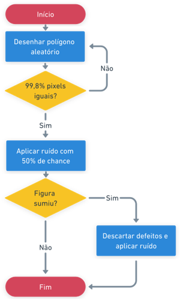
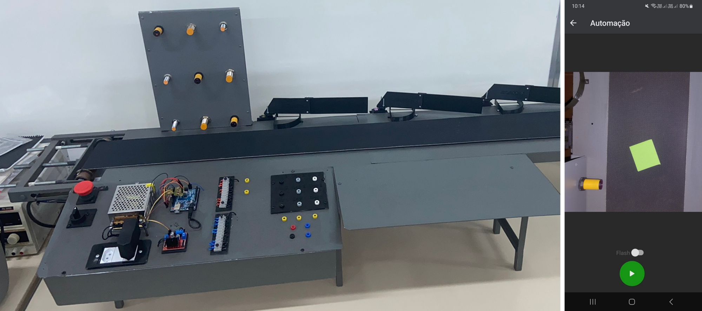
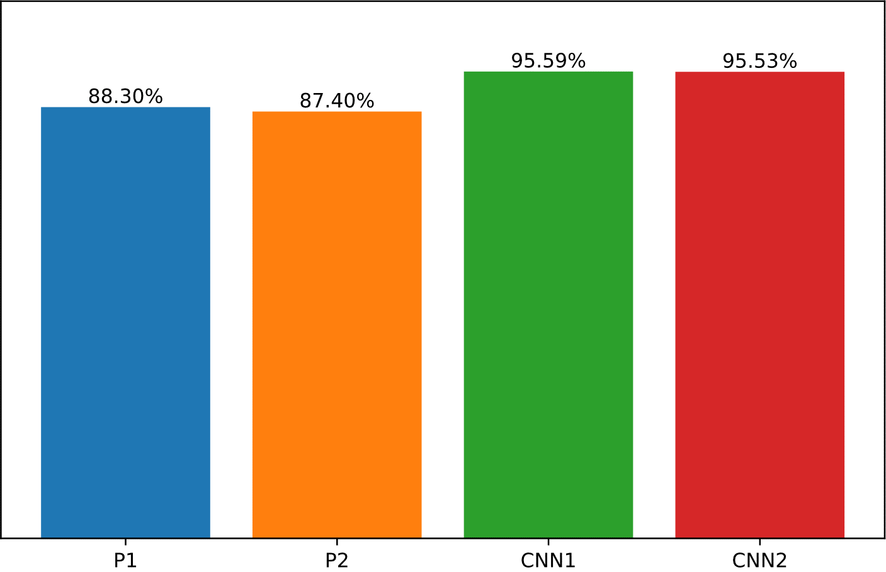
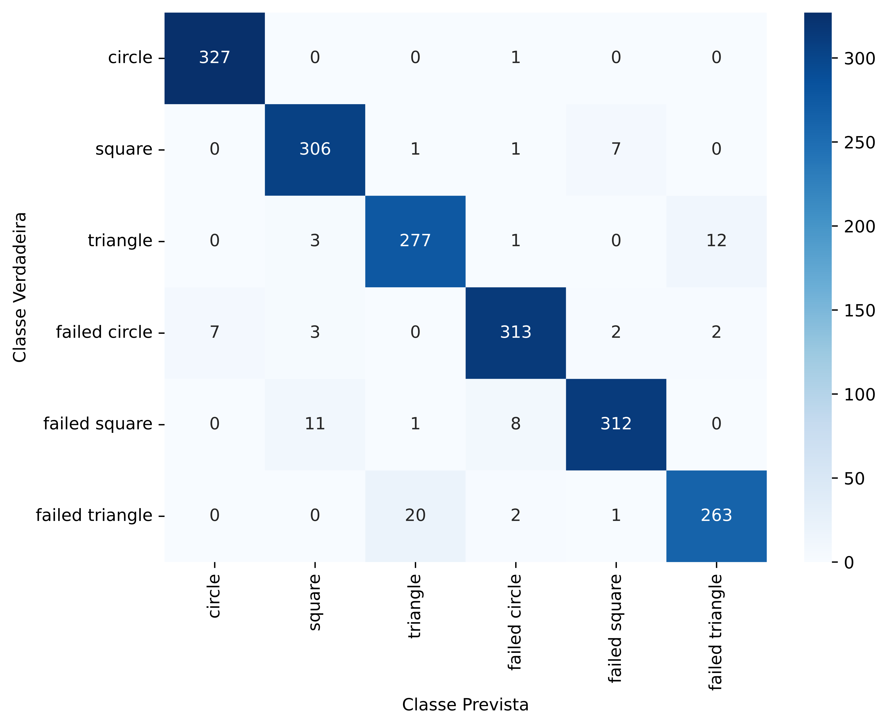

  

  <h3 align="center">Classificação de objetos com redes neurais</h3>

  

    Desenvolvimento de uma rede neural capaz de classificar e identificar falhas em objetos de uma linha produtiva industrial.
     
     
    <a href="./README/Monografia.pdf">Monografia</a>
    ·
    <a href="https://github.com/ludum-pro-bono/ludum-pro-bono-games/issues">Reportar Bug</a>
    ·
    <a href="https://github.com/ludum-pro-bono/ludum-pro-bono-games/issues">Sugerir funcionalidade</a>
  

    

# Metodologia

    
     
    Metodologia
     

    
     
    Pré-processamento
     

    
     
    Defeitos automáticos
     

    
     
    Esteira e aplicativo mobile
     

# Resultados

    
     
    Acurácias
     

    
     
    Matriz de confusão
     

